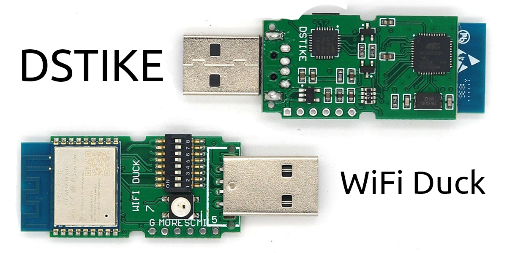

# WifiDuck 
#
WifiDuck involves combining WiFi capabilities with USB Rubber Ducky payloads. This could mean a device or setup that allows for executing USB Rubber Ducky payloads over a WiFi connection instead of a direct USB connection.
#
<!DOCTYPE html>
<html lang="en">
<head>
<meta charset="UTF-8">
<meta name="viewport" content="width=device-width, initial-scale=1.0">
</head>
<body>
  <div style="text-align:center;">
    
  </div>
</body>
</html>

#

1. Plug in your WiFi Duck
2. Connect to the WiFi network `wifiduck` with the password `wifiduck`
3. Open a browser and visit `192.168.4.1`
4. Write, save and run your first Ducky Script
5. [Recommended] Open `Settings` (top right corner) and update SSID and password

<!DOCTYPE html>
<html lang="en">
<head>
<meta charset="UTF-8">
<meta name="viewport" content="width=device-width, initial-scale=1.0">
</head>
<body>
  <div style="text-align:center;">
    
  </div>
</body>
</html>

#
# WifiDuck payloads

WifiDuck is a project that enables the creation of USB Rubber Ducky payloads that can be executed wirelessly over Wi-Fi. The project typically involves using a microcontroller like the ESP8266 to act as a bridge between a Wi-Fi network and a USB Rubber Ducky device. This setup allows for remote execution of payloads, making it particularly useful for penetration testing and ethical hacking scenarios.

Payloads for WifiDuck can be crafted similarly to traditional USB Rubber Ducky payloads, but they are adapted to work with the wireless capabilities provided by the ESP8266 or similar devices. The payloads are written in a scripting language that the microcontroller can understand and execute.

Payloads for WifiDuck can be much more complex and can include a variety of actions, such as keystroke injections, file manipulation, network reconnaissance, and more, depending on the goals of the penetration test or the scenario being simulated. However, it's essential to use such tools responsibly and ethically, respecting laws and regulations governing cybersecurity testing and research.

# Payloads

### YouTube.txt

This script essentially automates the process of opening Chrome, navigating to a specific YouTube video. 
However, it's worth noting that such automation scripts should be used responsibly and with respect to the terms of service of the services being automated.

### PythonExploit.txt

This payload script aims to execute a Python HTTP server exploit by leveraging PowerShell. It's important to note that this script assumes the target system has Python 3 installed. 
However, it's worth noting that such automation scripts should be used responsibly and with respect to the terms of service of the services being automated.
#

# Scripting

### Basics

Keys are separated by a single space.  
Everything written in a single line gets pressed and released at the same time.  
To write text, use the STRING function.  
It's compatible to Ducky Script, which was developed by the wonderful people at [Hak5](https://www.hak5.org/).  

| Example | Explanation |
| ------- | ----------- |
| WINDOWS <br> r | Type the Windows key and then the r key |
| WINDOWS r | Press the Windows key and the r key simultaneously |
| STRING WINDOWS r | Write WINDOWS r |

### Functions

| Command | Example | Description |
| ------- | ------- | ----------- |
| `REM` | `REM Hello World!` |Comment |
| `DEFAULTDELAY` or `DEFAULT_DELAY` | `DEFAULTDELAY 200` | Time in ms between every command |
| `DELAY` | `DELAY 1000` | Delay in ms |
| `STRING` | `STRING Hello World!` | Types the following string |
| `REPEAT` or `REPLAY` | `REPEAT 3` | Repeats the last command n times |
| `LOCALE` | `LOCALE DE` | Sets the keyboard layout. [List](#translate-keyboard-layout) |
| `KEYCODE` | `KEYCODE 0x02 0x04` | Types a specific key code (modifier, key1[, ..., key6]) in decimal or hexadecimal |
| `LED` | `LED 40 20 10` |Changes the color of the LED in decimal RGB values (0-255) |

### Standard Keys

| Key |
| --- |
| `a` - `z` |
| `A` - `Z` |
| `0` - `9` |
| `F1` - `F12` |

### Modifier Keys

| Key |
| --- |
| `CTRL` or `CONTROL` |
| `SHIFT` |
| `ALT` |
| `WINDOWS` or `GUI` |

### Other Keys

| Key |
| --- |
| `ENTER` |
| `MENU` or `APP`|
| `DELETE` |
| `HOME` |
| `INSERT` |
| `PAGEUP` |
| `PAGEDOWN` |
| `UP` or `UPARROW` |
| `DOWN` or `DOWNARROW` |
| `LEFT` or `LEFTARROW` |
| `RIGHT` or `RIGHTARROW` |
| `TAB` |
| `END` |
| `ESC` or `ESCAPE` |
| `SPACE` |
| `PAUSE or BREAK` |
| `CAPSLOCK` |
| `NUMLOCK` |
| `PRINTSCREEN` |
| `SCROLLLOCK` |

### Numpad Keys

| Key |
| --- |
| `NUM_0` - `NUM_9` |
| `NUM_ASTERIX` |
| `NUM_ENTER` |
| `NUM_MINUS` |
| `NUM_DOT` |
| `NUM_PLUS` |

### Examples

```
REM Hello World for Windows PCs
DEFAULTDELAY 200
GUI r
STRING notepad
ENTER
STRING Hello World!
```

## CLI Commands

The command line interface or CLI is accessible using a serial connection to the ESP8266 (115200 baud, Newline ending) or via the web interface at `192.168.4.1/terminal.html`.  

### General

| Command | Description | Example |
| ------- | ----------- | ------- |
| help | Returns all available commands | `help` |
| ram | Returns available memory in bytes | `ram` |
| version | Returns version number | `version` |
| settings | Returns list of settings | `settings` |
| set -n/ame <value> -v/alue <value> | Sets value of a specific setting | `set ssid "why fight duck"` |
| reset | Resets all settings to their default values | `reset` |
| status | Returns status of i2c connection with Atmega32u4 | `status` |
| run <...> | Starts executing a Ducky script | `run example.txt` |
| stop <...> | Stops executing a Ducky script | `stop example.txt` |

### SPIFFS File Management

| Command | Description | Example |
| ------- | ----------- | ------- |
| mem | Returns available, used and free memory of SPIFFS in bytes | `mem` |
| format | Formats SPIFFS | `format` |
| ls <...> | Returns list of files | `ls /` |
| create <...> | Creates file | `create example.duck` |
| remove <...> | Deletes file | `remove example.duck` |
| cat <...> | Returns content of file | `cat example.duck` |
| rename -fileA,a <value> -fileB,b <value> | Renames file | `rename example.duck example.txt` |
| write -f/ile <value> -c/ontent <value> | Writes (appends) data to file | `write example.txt "Hello World!"` |
| stream <...> | Opens file stream | `stream example.txt` |
| close | Closes file stream | `close` |
| read | Read and return the result from file stream | `read` |

If a stream is open, everything you type (except messages containing exactly `close` or `read`) will be written to the file until you type `close`!  

## How to Debug

To properly debug, you need to have both the Atmega32u4
and the ESP8266 connected via USB to your computer.  

That can be tricky when you only have a all in one board, so it might be useful
you built one yourself. You don't need to solder it, for example you can use an
Arduino Leonardo and a NodeMCU and connect them with jumper cables.  

Now open 2 instances of Arduino (so they run as separate processes!),
select the COM port and open the serial monitor for each device.
You might need to reset the Atmega32u4 to see serial output.
If that causes problems with the i2c connection, try to reset the ESP8266 too.  


### Translated Keyboard Layout ###
#

Currently supported keyboard layouts:  
---
```
- [:de: DE]
- [:gb: GB]
- [:us: US]
- [:es: ES]
- [:denmark: DK]
- [:ru: RU]
- [:fr: FR]
- [:belgium: BE]
- [:portugal: PT]
- [:it: IT]
- [:slovakia: SK]
- [:czech_republic: CZ]
- [:slovenia: SI]
- [:bulgaria: BG]
- [:canada: CA-FR]
- [:switzerland: CH-DE]
- [:switzerland: CH-FR]
- [:hungary: HU]
```
